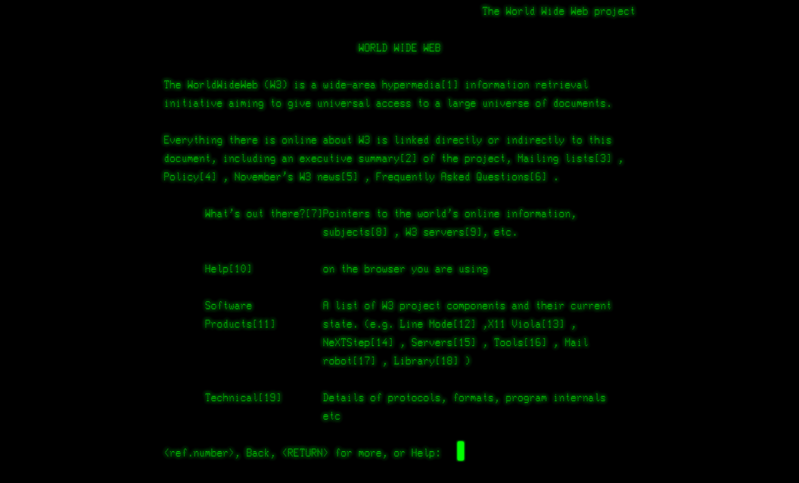

# The internet

### Index

## Birth of the internet

**Tim Berners-Lee**, a British scientist, invented the World Wide Web (WWW) in **1989**, while working at **CERN**. The web was originally conceived and developed to meet the demand for automated information-sharing between scientists in universities and institutes around the world.

On 30 April 1993, CERN put the World Wide Web software in the public domain. Later, CERN made a release available with an open licence, a more sure way to maximise its dissemination. These actions allowed the web to flourish.

## Interface of the Internet

With the creation of the web, there was also the need for a way to view the files of which it consists. The first browser, also created by Sir Tim Berners-Lee, was the **WorldWideWeb browser**.

### WorldWideWeb

*Screen capture of the first browser developed by Sir Tim Berners-Lee*

The idea of **hypertext** preceded the World Wide Web by decades. But nearly all hypertext systems worked on local files. Tim Berners-Lee wanted to create a system that would work across networks so that people could link from a file on one machine to another file on another machine.

WorldWideWeb wasn't just a programme for browsing files. It was a browser and editor. The introductory text reads:

> HyperMedia Browser/Editor, An excercise in global information availability by Tim Berners-Lee

At its heart, WorldWideWeb is a word processor …but with links. And just as you can use a word processor purely for reading documents, the real fun comes when you write your own. Especially when you throw hyperlinks into the mix. There was one major downside to the WorldWideWeb browser: it could only be used on a NeXT computer. 

### Line Mode browser

To make the Web more widely accessible (because almost nobody had a NeXT machine), a second browser project was developed at CERN: the Line Mode browser. The Line Mode browser was first released in 1991 and was compatible with most unix / linux systems. Thereby instantly bring the Web to commonly used, much lower powered devices, such as the "line mode" terminals that were used to access mini computers, still common at the time.

*Screen capture of the Line Mode browser*

## Language of the Internet

Computers and by extension web browsers are inherently dumb. We can't expect a computer to read a text document an make a distinction between titles, paragraphs, links, lists, etc. Let's put ourselves in the shoes of a computer and take a look at a document you most likely won't understand:

**image goes here**

Just like we can't give **meaning** to the text in the above example, computers can't give meaning to the data they get from the web.

