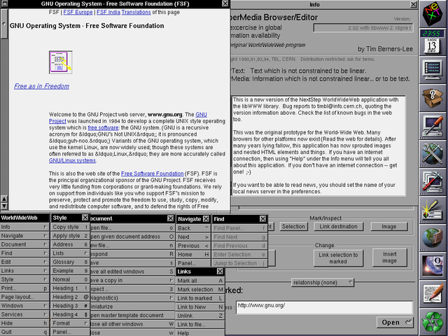

# The internet

## A network of networks

Before the invention of the internet, many universities and institutions already had some computer infrastructure, consisting of computers connected to each others as local networks. Using these computers, one could therefore publish  content and communicate within its own institution, but not globally.

To write this content, people could use a very simple but powerful innovation: **hypertext**. Hypertext simply means text that can contain "hyperlinks", which is a fancy way to describe a link pointing to texts located in other parts of the network.

But again, given the fact that networks were only accessible locally, the texts could only be linked and accessed locally. So, if a researcher in one university wanted to consult a document from another university, she would have to take her car and drive over there, in order to log into the University's local network and finally access the document. Not very practical, is it ?

A British scientist named Tim Berners-Lee, who worked at CERN, invented in 1989 a software called the World Wide Web (that's what the "www" means in a web address), that allowed people to publish content and make it accessible to anyone having the address, across all networks. That's why the Internet is often called: the network of networks.
And thus, the first web site was born! You can still visit it at this address: http://info.cern.ch

-.jpg)

*Portrait of Tim Berners-Lee - © Paul Clarke, CC BY-SA 4.0 <https://creativecommons.org/licenses/by-sa/4.0>, via Wikimedia Commons*

## a browser to surf on the web

Now, to visit the website (and the many others which followed) one needed another piece of software. Tim Berners-Lee thus created the so-called "WorldWideWeb browser", the first **a Web browser**. This first version was very basic, only allowing to show text and hyperlinks.




*Screen capture of the first browser developed by Sir Tim Berners-Lee - Image author: Tim Berners-Lee (public domain)*

## The internet, today

Fast forward to 2021: modern web browsers can display not only text and links, but also images, videos, and run full-fledged applications!

Therefore, anyone can now not only consume but also create new content: the internet has become the main platform for most of our professional but also private lifes. Communicating with friends and families, collaborating with colleagues, managing your bank account or planning your holidays... Everything is now happening online, thanks to the Internet !


### HyperText Markup Language

We already mentioned the Hypertext as a great innovation. Let's have a closer look at the whole coding language that enables it.

HTML (**H**yper**t**ext **M**arkup **L**anguage) is the code that is used to structure a web page and its content. For example, content could be structured within a set of paragraphs, a list of bulleted points, or using images and data tables.

HTML consists of a **series of elements**, which you use to enclose, or wrap, different parts of the content to make it appear a certain way, or act a certain way. The enclosing tags can make a word or image hyperlink to somewhere else, can italicize words, can make the font bigger or smaller, and so on.

```html
<p>This is a paragraph, because it is enclosed in a "p" html tag.</p>
<p>This is another paragraph, also enclosed in a "p" html tag.</p>
```

HTML is very easy to learn... So, let's do that!


