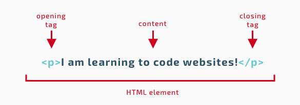

# Intro to HTML

## What is HTML?

HTML is not a programming language; it is a markup language that defines the structure of your content. HTML consists of a series of elements, which you use to enclose, or wrap, different parts of the content to make it appear a certain way, or act a certain way. The enclosing tags can make a word or image hyperlink to somewhere else, can italicize words, can make the font bigger or smaller, and so on.  For example, take the following line of content:

```My cat is very grumpy```. 

If we wanted the line to stand by itself, we could specify that it is a paragraph by enclosing it in paragraph tags:

```<p>My cat is very grumpy</p>```

### Anatomy of an HTML element

Let's explore this paragraph element a bit further.



The main parts of our element are as follows:

1. **The opening tag**: This consists of the name of the element (in this case, p), wrapped in opening and closing angle brackets. This states where the element begins or starts to take effect — in this case where the paragraph begins.
2. **The closing tag**: This is the same as the opening tag, except that it includes a forward slash before the element name. This states where the element ends — in this case where the paragraph ends. Failing to add a closing tag is one of the standard beginner errors and can lead to strange results.
3. **The content**: This is the content of the element, which in this case, is just text.
4. **The element**: The opening tag, the closing tag and the content together comprise the element.

#### Nesting elements

HTML elements can be **nested** in other HTML elements. 
Let's continue with the HTML element from the previous example.

I would like to put emphasis on the word *grumpy*. To do this I will use the `<em>` element and wrap it around the word I want to emphasize. 

```<p>My cat is very <em>grumpy</em></p>```

In this example the `<em>` element is **nested** in the `<p>` element. 

> ! Important: When nesting html elements, make sure to close the nested element before closing the parent element

