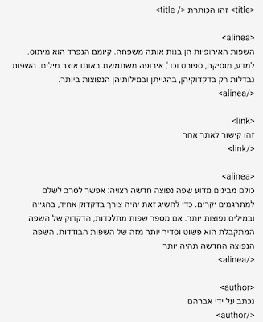

# Semantic HTML

## What are semantics

Computers and by extension web browsers are inherently dumb. We can't expect a computer to read a text document an make a distinction between titles, paragraphs, links, lists, etc.   

Let's put ourselves in the shoes of a computer and take a look at a document you most likely won't understand:


Just like we can't give **meaning** to the text in the above example, computers can't give meaning to the data they get from the web. Therefore we use a **markup language** to add additional meaning to the text. 



By adding some `<tags>` to the document that describe the content, we have a better understanding of the meaning and structure of the text. The area of linguistics that is concerned with the meaning of text is called **semantics**.

## Why use semantics

Semantics are relied on everywhere around us — we rely on previous experience to tell us what the function of an everyday object is; when we see something, we know what its function will be. So, for example, we expect a red traffic light to mean "stop", and a green traffic light to mean "go". Things can get tricky very quickly if the wrong semantics are applied (Do any countries use red to mean "go"? I hope not.)

## Semantic HTML

The HTML5 specification includes several semantic elements to help organize documents. Semantic elements are specifically designed to communicate meaning to the browser, developer, reader, and any other technologies interpreting the document (e.g. voice assistants).

### Section elements in HTML5

- **HTML Navigational Element** (`<nav>`) defines a section that contains navigation links that appear often on a site. You can have primary and secondary menus, but you never nest, or put a `<nav>` element inside a `<nav>` element.
- **HTML Article Element** (`<article>`) defines a piece of self-contained content. It does not refer to the main content alone and can be used for comments and widgets.
- **HTML Section Element** (`<section>`) defines a section of a document to indicate a related grouping of semantic meaning. Utilize the section element providing extra context from the parent element makes sense.
- **HTML Aside Element** (`<aside>`) defines a section that, though related to the main element, doesn't belong to the main flow, like an explanation box or an advertisement. It has its own outline, but doesn't belong to the main one.

### Other Semantic HTML elements used in Sectioning


- **HTML Body Element** (`<body>`) defines all the content of a document. It contains all the content and HTML tags.
- **HTML Header Element** (`<header>`) defines a page which typically contains the logo, title, and navigation. The header can also be used in other semantic elements such as `<article>` or `<section>` — or section header, containing perhaps the section's heading, author name, etc. `<article>`, `<section>`, `<aside>`, and `<nav>` can have their own `<header>`. Despite its name, it is not necessarily positioned at the beginning of the page or section.
- **HTML Footer Element** (`<footer>`) defines a page footer which typically contains the copyright, legal notices and sometimes some links — or section footer, containing perhaps the section's publication date, license information, etc. `<article>`, `<section>`, `<aside>`, and `<nav>` can have their own `<footer>`. Despite its name, it is not necessarily positioned at the end of the page or section.

### Example layout

The example below is a layout for the body of blog page. There is a `<header>` with an `<h1>` element and a `<nav>` element which contains the navigation links. On the same level as the `<header>` we have a `<section>` and `<footer>` element. The main `<section>` element has a `<h2>` title, 2 `<articles>` and an `<aside>`.

```html
<body>
    <header>
      <nav>
        <ul>
          <li><a href="#">link</a></li>
          <li><a href="#">link</a></li>
          <li><a href="#">link</a></li>
        </ul>
      </nav>
      <h1>
        Page Title
      </h1>
    </header>

    <section>
      <h2>
        My Blog Posts
      </h2>
      <article>
        <header>
          <p>
            Article Title
          </p>
        </header>
        <p>
          content
        </p>
      </article>
      <article>
        <header>
          <p>
            Article Title
          </p>
        </header>
        <p>
          content
        </p>
      </article>
      <aside>
        <p>
          Author info
        </p>
      </aside>
    </section>

    <footer>
      Copyright Info
    </footer>
  </body>
```

