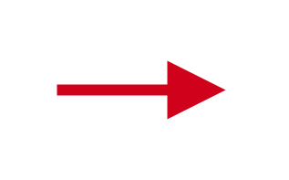

# Semantic HTML

## Why use semantics

Semantics happens when we attach a specific signification to a sign. We have learned to recognize an arrow as pointing towards a direction - a dog, a cat, does not understand that from looking at the sign below. In fact, it is hard for our brain to look at this sign and not infer its semantic because our brains love it!



We use semantics all the time, everywhere around. This helps us navigate our lives in cities for example. We learn conventions (such as a the traffic signs) and rely on them to tell us what lies ahead. We see, we know.

In HTML, when we tell that a chunk of text is a Paragraph, the browser then "knows" how to render it in a specific way. For instance, a screen reader software can read the paragraph in a specific tone. This is particularly useful with images for instance. Properly adding syntax to an image tag can make or break the blind person's understanding of the content.

## Semantic HTML

The HTML5 specification includes several semantic elements to help organize documents. Semantic elements are specifically designed to communicate meaning to the browser, developer, reader, and any other technologies interpreting the document (e.g. voice assistants, screen readers, search engines...).

### Section elements in HTML5

(Source: [Using HTML sections and outlines](https://developer.mozilla.org/en-US/docs/Web/Guide/HTML/Using_HTML_sections_and_outlines#section_elements_in_html5) by [Mozilla Contributors](https://developer.mozilla.org/en-US/docs/Web/Guide/HTML/Using_HTML_sections_and_outlines/contributors.txt), licensed under CC-BY-SA 2.5.)

'- **HTML Navigational Element** (`<nav>`) defines a section that contains navigation links that appear often on a site. You can have primary and secondary menus, but you never nest, or put a `<nav>` element inside a `<nav>` element.
- **HTML Article Element** (`<article>`) defines a piece of self-contained content. It does not refer to the main content alone and can be used for comments and widgets.
- **HTML Section Element** (`<section>`) defines a section of a document to indicate a related grouping of semantic meaning. Utilize the section element providing extra context from the parent element makes sense.
- **HTML Aside Element** (`<aside>`) defines a section that, though related to the main element, doesn't belong to the main flow, like an explanation box or an advertisement. It has its own outline, but doesn't belong to the main one.'

### Other Semantic HTML elements used in Sectioning
The same Mozilla Contributor advances the following definitions for the elements used in Sectioning:

'- **HTML Body Element** (`<body>`) defines all the content of a document. It contains all the content and HTML tags.
- **HTML Header Element** (`<header>`) defines a page which typically contains the logo, title, and navigation. The header can also be used in other semantic elements such as `<article>` or `<section>` — or section header, containing perhaps the section's heading, author name, etc. `<article>`, `<section>`, `<aside>`, and `<nav>` can have their own `<header>`. Despite its name, it is not necessarily positioned at the beginning of the page or section.
- **HTML Footer Element** (`<footer>`) defines a page footer which typically contains the copyright, legal notices and sometimes some links — or section footer, containing perhaps the section's publication date, license information, etc. `<article>`, `<section>`, `<aside>`, and `<nav>` can have their own `<footer>`. Despite its name, it is not necessarily positioned at the end of the page or section.'

### Example layout

The example below is a layout for the body of blog page. There is a `<header>` with an `<h1>` element and a `<nav>` element which contains the navigation links. On the same level as the `<header>` we have a `<section>` and `<footer>` element. The main `<section>` element has a `<h2>` title, 2 `<articles>` and an `<aside>`.

```html
<body>
    <header>
      <nav>
        <ul>
          <li><a href="#">link</a></li>
          <li><a href="#">link</a></li>
          <li><a href="#">link</a></li>
        </ul>
      </nav>
      <h1>
        Page Title
      </h1>
    </header>

    <section>
      <h2>
        My Blog Posts
      </h2>
      <article>
        <header>
          <p>
            Article Title
          </p>
        </header>
        <p>
          content
        </p>
      </article>
      <article>
        <header>
          <p>
            Article Title
          </p>
        </header>
        <p>
          content
        </p>
      </article>
      <aside>
        <p>
          Author info
        </p>
      </aside>
    </section>

    <footer>
      Copyright Info
    </footer>
  </body>
```

