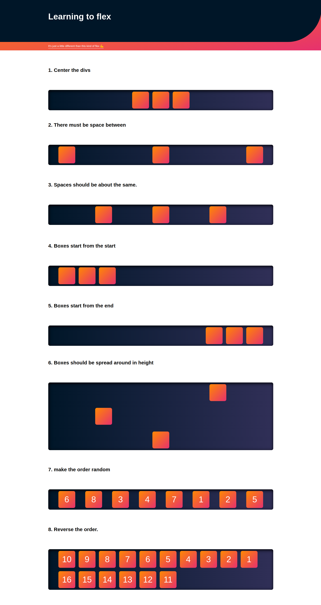

# Flex-box

So far we have not touched flex-box, and there is a good reason for it. It makes our lives as developers much easier, so easy that you would forget about floats,inline-blocks,etc..

I strongly advice to take a look at the documentation to get a brief understanding about the power of the **dar**- flex-box.  

## Set-up:

Copy and past this entire code in your editor:

```html
<html>
<head>
    <meta charset="utf-8" />
    <style>
    <style>

    /* *****Don't change this!!******* */

    body{
        background-color: rgb(255, 255, 255);
        font-family: 'Lucida Sans', 'Lucida Sans Regular', 'Lucida Grande', 'Lucida Sans Unicode', Geneva, Verdana, sans-serif;
        margin:0;

    }
    .box{    
      border-radius:10px;
      background-image: linear-gradient(to right bottom,#FF8803, #E6316E);


      height:100px;
      width:100px;
      margin:10px;

      line-height:100px;
      font-size:50px;
      transition: all .4s ease-in-out;
    }

    .box:hover{
        height:110px;
        width:115px;
    }

    .container{
      text-align:center;
      background-image: linear-gradient(to right,#001628, #302f57);
      color:white;
      height:100%;
      margin-bottom:200px;
      align-items: center;
      padding:0 50px;
      box-shadow: inset 2px 5px 20px #000000;
      border-radius: 10px;
      margin:0 15%;
    }
    
    body:last-child{
        margin-bottom: 100px;
    }

    h2{
      font-size:30px;
      margin:150px 15% 40px;
    }

    header{
        height: 350px;
        background-image: linear-gradient(to right bottom,#FF8803, #E6316E);
    }

    .header__container{
        height:300px;  
        display: flex;
        align-items: center;
        color:white;
        background-color:#001628;
        border-bottom-right-radius: 200px;
    }

    header p{
        line-height: 50px;
        margin: auto 15%;
        color: white;
        display: inline;
        padding-bottom: 5px;
        border-bottom: solid 1px white;
    }

    h1{
        margin:0 15%;
        font-size: 50px;    
    }

/*********************************************************/
/****************END OF THE NO TOUCHY ZONE****************/
/*********************************************************/

/*Is there something that needs display:flex to make flex work?*/

/****************Exercise 1****************/


/****************Exercise 2****************/


/****************Exercise 3****************/


/****************Exercise 4****************/


/****************Exercise 5****************/


/****************Exercise 6****************/


/****************Exercise 7****************/


/****************Exercise 8****************/


</style>
    </style>
</head>
<body>
<!--DO NOT CHANGE THE HTML OR CLASS NAMES ONLY WRITE IN CSS-->
<header>
    <div class="header__container">
        <h1>Learning to flex</h1>
    </div>
    <p>It's just a little different than this kind of flex 💪  -- Please make an exact copy of the example image!</p>
</header>


    <!--Start first-->
  <h2>1. Center the divs</h2>
  <div class="container container--1">
    <div class="box"></div>
    <div class="box"></div>
    <div class="box"></div>
  </div>

  <!--Start second-->
  <h2>2. There must be space between</h2>
  <div class="container container--2">
    <div class="box"></div>
    <div class="box"></div>
    <div class="box"></div>
  </div>

  <!--Start third-->
  <h2>3. Spaces should be about the same.</h2>
  <div class="container container--3">
    <div class="box"></div>
    <div class="box"></div>
    <div class="box"></div>
  </div>

  <!--Start fourth-->
  <h2>4. Boxes start from the start</h2>
  <div class="container container--4">
    <div class="box"></div>
    <div class="box"></div>
    <div class="box"></div>
  </div>

  <!--Start fifth-->
  <h2>5. Boxes start from the end</h2>
  <div class="container container--5">
    <div class="box"></div>
    <div class="box"></div>
    <div class="box"></div>
  </div>

  <!--Start sixth-->
  <h2>6. Boxes should be spread around in height</h2>
  <div class="container container--6">
    <div class="box"></div>
    <div class="box"></div>
    <div class="box"></div>
  </div>

  <!--Start seventh-->
  <h2>7. make the order random</h2>
  <div class="container container--7">
    <div class="box">1</div>
    <div class="box">2</div>
    <div class="box">3</div>
    <div class="box">4</div>
    <div class="box">5</div>
    <div class="box">6</div>
    <div class="box">7</div>
    <div class="box">8</div>
  </div>

  <!--Start eigth-->
  <h2>8. Reverse the order.</h2>
  <div class="container container--8">
    <div class="box">1</div>
    <div class="box">2</div>
    <div class="box">3</div>
    <div class="box">4</div>
    <div class="box">5</div>
    <div class="box">6</div>
    <div class="box">7</div>
    <div class="box">8</div>
    <div class="box">9</div>
    <div class="box">10</div>
    <div class="box">11</div>
    <div class="box">12</div>
    <div class="box">13</div>
    <div class="box">14</div>
    <div class="box">15</div>
    <div class="box">16</div>
  </div> 
</body>
</html>
```

#### You have to make a exact copy of this by just using flex-box:


