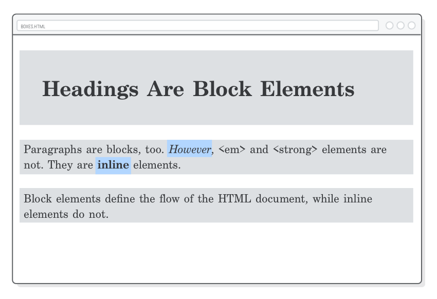
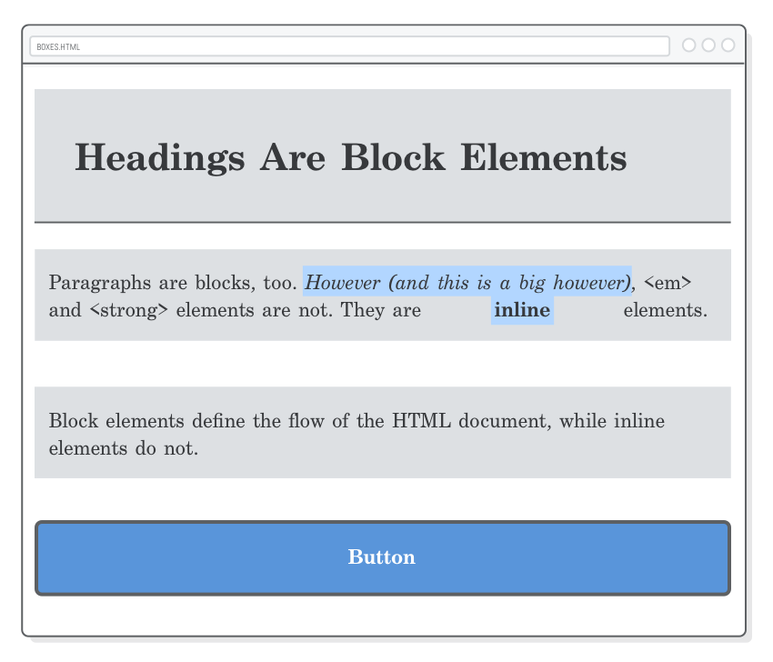
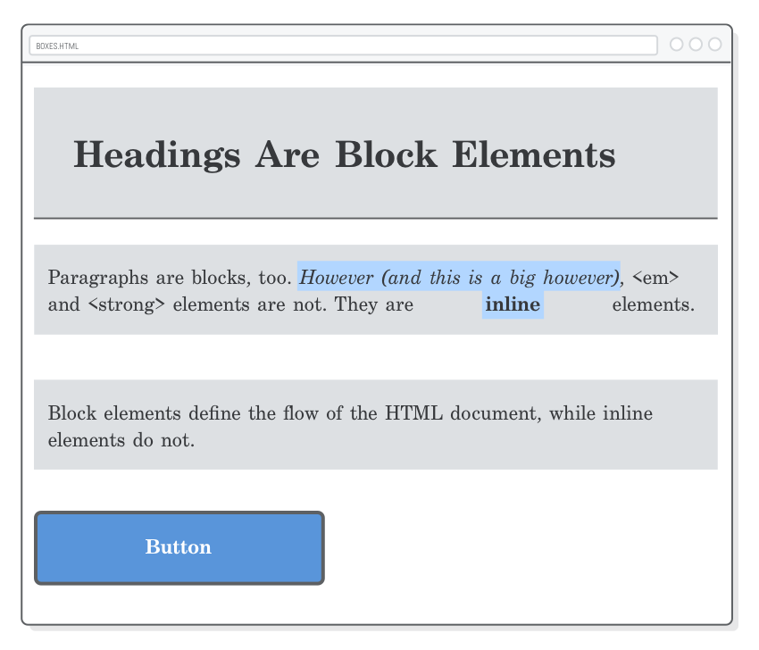

# CSS Positioning

The big part of your job is to place elements on the screen, and control how they should adapt to the adjacent content as well as to the screen size (mobile phone or Desktop computer). In a word: **positioning**

CSS offers several ways to control the positioning of the elements on the screen. Let's start by giving you an understanding of how the element itself is laid out.

## The Box Model

Each HTML element rendered on the screen is a box, and they come in two flavors: “block” boxes and “inline“ boxes.

Take a look at this visual representation of the difference between a block and an inline element.


All the HTML elements that we’ve been working with have a default type of box. For instance, `<h1>` and `<p>` are **block-level elements**, while `<em>` and `<strong>` are **inline elements**. 

Here is an example of the difference in behaviour between the two. (Blue = inline element, Grey = block element)


This shows us a couple of very important behaviors associated with block and inline boxes:

- **Block boxes** always appear **below** the previous block element. This is the “natural” or “static” flow of an HTML document when it gets rendered by a web browser.

- The **width of block boxes** is set automatically based on the width of its parent container. In this case, our blocks are always the width of the browser window.

- The default **height of block boxes** is based on the content it contains. When you narrow the browser window, the `<h1>` gets split over two lines, and its height adjusts accordingly.

- **Inline boxes** don’t affect **vertical spacing**. They’re not for determining layout—they’re for styling stuff *inside* of a block.

- The **width of inline boxes** is based on the content it contains, not the width of the parent element.

### Changing box behaviour

We can override the default box type of HTML elements with the CSS `display` property. For example, if we wanted to make our `<em>` and `<strong>` elements blocks instead of inline elements, we could update our rule in `box-styles.css` like so:

```css
em, strong {  background-color: #B2D6FF;  display: block;}
```


Now, the blue inline elements act like our headings and paragraphs: they start on their own line, and they fill the entire width of the browser. This comes in handy when you’re trying to turn `<a>` elements into buttons or format `` elements (both of these are inline boxes by default).

## Content, padding, border, and margin

The “CSS box model” is a set of rules that determine the dimensions of every element in a web page. It gives each box (both inline and block) four properties:

- **Content** – The text, image, or other media content in the element.
- **Padding** – The space between the box’s content and its border.
- **Border** – The line between the box’s padding and margin.
- **Margin** – The space between the box and surrounding boxes.

Together, this is everything a browser needs to render an element’s box. The content is what you author in an HTML document, and it’s the only one that has any semantic value. The rest of them are purely presentational, so they’re defined by CSS rules.


## Padding

Let’s start from the inside out. We’ve already been working with content, so on to padding. The `padding` property…you guessed it…defines the padding for the selected element:

```
h1 {  padding: 50px;}
```

This adds 50 pixels to *each side* of the `<h1>` heading. Notice how the background color expands to fill this space. That’s always the case for padding because it’s inside the border, and everything inside the border gets a background.



Sometimes you’ll only want to style one side of an element. For that, CSS provides the following properties:

```css
h1 {  
padding-top: 20px;  
padding-bottom: 20px;  
padding-left: 10px;  
padding-right: 10px;}
```

When you only mention `padding: 50px;` it's a **shortcut notation**: you are actually saying: 

```css
h1 {  
padding-top: 50px;  
padding-bottom: 50px;  
padding-left: 50px;  
padding-right: 50px;
}
```

## Borders

Continuing our journey outward from the center of the CSS box model, we have the border: a line drawn around the content and padding of an element. The `border` property requires a new syntax that we’ve never seen before. First, we define the stroke width of the border, then its style, followed by its color.


Example: 

```css
h1 {  border: 1px solid #5D6063;}
```

This would draw a rectangle around the H1 element.

Like `padding`, there are `-top`, `-bottom`, `-left`, and `-right` variants for the `border` property:

```css
h1{ border-bottom: 1px solid #5D6063;}
```

This would simply draw a line underneath the H1 element.

## Margins

Margins define the space outside of an element’s border. Or, rather, the space between a box and its surrounding boxes. Let’s add some space to the bottom of each `<p>` element:

```css
p {  
padding: 20px 0 20px 10px;  
margin-bottom: 50px;
}
```

Margins and padding can accomplish the same thing in a lot of situations, making it difficult to determine which one is the “right” choice. The most common reasons why you would pick one over the other are:

- The padding of a box has a background, while margins are always transparent.
- Padding is included in the click area of an element, while margins aren’t.

If none of these help you decide whether to use `padding` over `margin`, then don’t fret about it—just pick one. In CSS, there’s often more than one way to solve your problem.

## Explicit dimensions

So far, we’ve let our HTML elements define their dimensions automatically. The paddings, borders, and margins we’ve been playing with all wrap around whatever content happens to be inside the element’s box. If you add more text to our `<em>` element, everything will expand to accommodate it:



But, sometimes our desired layout calls for an explicit dimension, like a sidebar that’s exactly 250 pixels wide. For this, CSS provides the `width` and `height` properties. These take precedence over the default size of a box’s content.

Let’s give the blue button an explicit width by adding the following property  

```css
button {  
  width: 200px;
  }
```

Instead of being as wide as the browser window, our button is now 200 pixels, and it hugs the left side of the page:



## Centering with auto-margins

When you set the left and right margin of a block-level element to `auto`, it will center the block in its parent element.

For example, we can center our button with the following:

```css
div {  
    color: #FFF;  
    background-color: #4A90E2;  
    font-weight: bold;  
    padding: 20px;  
    text-align: center;  
    width: 200px;  
    box-sizing: border-box;  
    margin: 20px auto;
}
```

Note that this only works on blocks that have an explicit width defined on them. Remove that `width: 200px` line, and our button will be the full width of the browser, making “center alignment” meaningless.


# Summary

We’ll learn more about the practical uses of the CSS box model as we get deeper into constructing complex web pages. For now, think of it as a new tool in your CSS toolbox. With a few key concepts from this chapter, you should feel much more equipped to convert a design mockup into a real-life web page:

- Everything is a **box**.
- Boxes can be **inline** or **block-level**.
- Boxes have content, padding, **borders**, and **margins**.
- They also have seemingly arbitrary rules about how they interact.
- Mastering the CSS box model means you can lay out most web pages.

Like the last chapter, the CSS properties we just covered might seem simple—and they sort of are. But, start looking at the websites you visit through the lens of the CSS box model, and you’ll see this stuff literally everywhere.


All right, let's go ahead and continue learning by doing a few positioning challenges using 3 techniques: Display, Position, and Flexbox!
