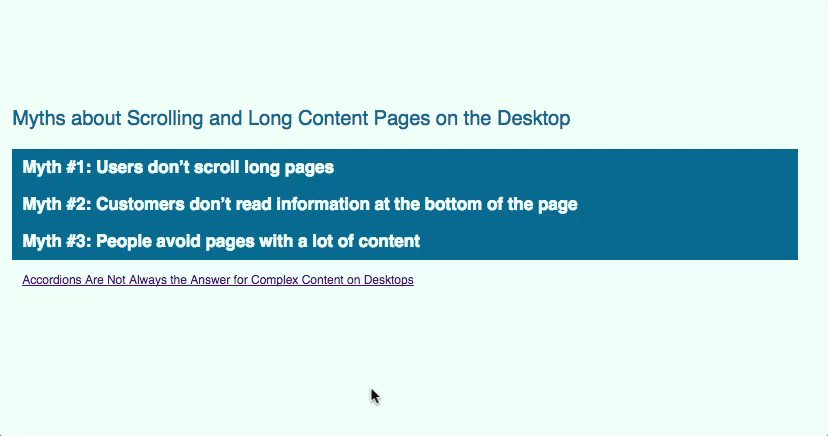

# Small CSS animations series - 07

In these series of exercises you have to replicate a series of elements.

Make an exact copy of the examples and write your own HTML and CSS!

## SPECIAL

**You will need this text:** 

---

Myths about Scrolling and Long Content Pages on the Desktop

---

Myth #1: Users don’t scroll long pages

----

Users do scroll when the content is relevant, organized properly, and formatted for ease of scanning. In fact, people prefer scrolling the page for content over pagination when the topics within that page answer the right questions. The standard scroll wheel on a mouse, arrow keys, and track pads have made scrolling much easier than acquiring click targets.

---

Myth #2: Customers don’t read information at the bottom of the page

---

Our eyetracking research show that while users spend 80% of their attention on information above the page fold, they allocate 20% of it to content below the fold. Reluctance to scroll is a behavior of the past. While you should still be mindful of people’s limited attention span on websites and prioritize content wisely, you shouldn’t fear long formats. People will see the bottom if you give them good reason to go there.

---

Myth #3: People avoid pages with a lot of content

---

People have the ability to handle vast amounts of information, when presented properly. In our Writing for the Web courses, we emphasize the requirement for writing well, and more importantly, writing for web-based reading. Reading and scanning patterns are different between web-based and print-based content. While online users typically scan for information, it does not mean they want less information. Websites should not be information light. The same information needs to be written, structured, and presented differently.

---

Accordions Are Not Always the Answer for Complex Content on Desktops

---

## Before you start

Please copy and paste this code inside your editor:

```html
<html>
     <head>
     <meta charset="utf-8" />
         <style>
         /* Put your styling here */
         </style>
 </head>
<body>

<!-- put your content here -->

</body>

</html>
```

## Animated component:


